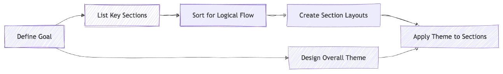
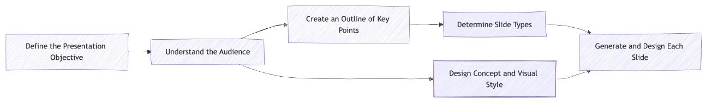
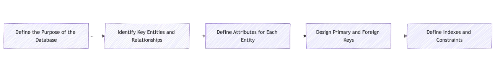

<h1 align="center">prai 🤖</h1>
<h3 align="center">JS Framework for building step-by-step LLM instructions<br>(<ins>pr</ins>ogrammable <ins>ai</ins>)</h3>
<br/>

<p align="center">
  <a href="https://npmjs.com/package/prai" target="_blank">
    
  </a>
  <a href="https://npmjs.com/package/prai" target="_blank">
    
  </a>
  <a href="https://twitter.com/pmndrs" target="_blank">
    
  </a>
  <a href="https://discord.gg/ZZjjNvJ" target="_blank">
    
  </a>
</p>

Giving LLMs autonomy can be powerful, but some problems require clear instructions for reliable, correctly formatted results.

```bash
npm install prai
```

Let's look at some **prai** <ins>use cases</ins>.

| Desinging a Homepage       |         |
| -------------------------- | ----------------------------------- |
| Creating a Presentation    |     |
| Creating a Database Schema |  |

We recommend **prai** for problems that are best solved with a structured process, where some steps involve reasoning or decision-making.

### What does it look like?

```ts
import { vllm, task, step } from 'prai'
import { array, number, object, string, tuple } from 'zod'

const brandName = `pmndrs`
const brandDescription = `Open source developer collective`

const result = await task(
  vllm({ baseURL: '...', model: '...', apiKey: '...' }),
  () => `Define a shadcn theme for my brand`,
  async (task) => {
    const adjectives = step(
      task,
      () => `list some adjectives fitting the design of the ${brandName} brand which is a ${brandDescription}`,
      array(string()),
    )
    const coreTheme = step(
      task,
      () => `Based on the ${adjectives}, derive fitting color theme`,
      object({
        background: colorScheme,
        foreground: colorScheme,
        primary: colorScheme,
        secondary: colorScheme,
        accent: colorScheme,
        border: colorScheme,
        radius: number().describe('radius in rem'),
      }),
    )

    return step(
      task,
      () => `Expand the ${coreTheme} to a full shadcn theme`,
      object({
        background: colorScheme,
        //full scheme in /examples/theme
      }),
    )
  },
)

const colorScheme = tuple([
  number().describe('hue in degree (0-360)'),
  number().describe('saturation in percent (0-100)'),
  number().describe('lightness in percent (0-100)'),
]).describe('hsl color')

console.log(result.value)
```

**prai** currently supports the LLM inference engines [vllm](https://github.com/vllm-project/vllm), [llama.cpp](https://github.com/ggml-org/llama.cpp), and [sglang](https://github.com/sgl-project/sglang).

| Concept | Description                                                                                                                                                                                                                                                                                                                                                                                                    |
| ------- | -------------------------------------------------------------------------------------------------------------------------------------------------------------------------------------------------------------------------------------------------------------------------------------------------------------------------------------------------------------------------------------------------------------- |
| Task    | A task represents a single AI interaction with a specific goal. It manages the conversation context and provides methods to communicate with the AI.                                                                                                                                                                                                                                                           |
| Step    | Steps are the core building blocks for processing data. They allow to structured data based on a natural language prompt while guranteeing the correct structure on the output. By default steps like filter or combine are provided which can be extended to build higher level abstractions. Steps can be chained together to create processing pipelines. Each step creates one or more queries to the LLM. |
| Query   | A query is the request sent to the LLM containing the message history. It includes a unique requestId, taskId, messages array, and returns a result. Steps use queries to communicate with the LLM and process the responses.                                                                                                                                                                                  |
| Data    | The information flowing through steps in a task. This can be imported images, imported audio, imported json data, outputs from previous steps such as raw text, or structured data.                                                                                                                                                                                                                            |

### TODO for release

- rename data -> resource

- @prai/trace

- generic caching implementation + implement this caching with the events already send with @prai/redis which should allow to continue interrupted tasks and allow interrupting a task for a user request + dont jump into task executions if the task result is already computed to safe time (find the steps/tasks in the cache based on their name which is unqiue inside each process)
- support abstract multiplexing interface with concrete interface for redis (add a "running" event that the current process owner must send every 10 seconds. After a 20 second timeout all other runners will try to take over the process by sending "alive" the first one to be written into the stream will be the new process owner)

- multi-step (concatenate multiple steps into one llm request e.g. allowing to put a thinking step before another step)
- sql step, think/criticise step

- option to use all previous steps in the current task as dependencies (e.g. for the webxr operator)

### Roadmap

- Metrics (prometheus integration for metrics)
- RabbitMQ integration for logging, caching, and multiplexing
- prebuild image & audio embeddings for reuse
- RAG step?
- toolStep (support tool calls to build agent steps; make sure we can do a multi-step with a tool call and then e.g. a json result for e.g. returning specific data from a general search)
- try out the concept of interleaved multi step (basically have the grammar enforce a thinking structure - same as multi step but giving the invidiual thinking steps inside the grammar and not in the instructions at the start)
