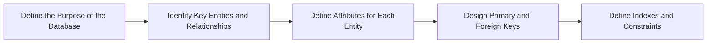

https://mermaid.live/edit#pako:eNpFUcFqwzAM_RXhc3tY210yGISlg7INSndb04May4khsYMss4XSf5-bNJtPeo_39CT5oiqvSWXKtP67apAF3g9PpYP08odjQcY6AmkI9pF7Hwi8GWGBgmcMdILl8hny1XGnyYk1A7zRANtUiqUA6DQcqEWx3oXG9uF0772afOs5Ihdhe46SPMYzbLFqpi7D7FhPjk1yBFs72LPtkIcx4tUz3biU_ZewmfSPc8LOafq5j_SSphFG62SWl04tVEfcodXpHJcbW6q0aUelylKpyWBspVSluyYpRvGfg6tUJhxpodjHuplB7DUKFRZrxk5lBtuQ2B7dl_f_mLQVzx_T_cdvuP4CLUGEBQ

