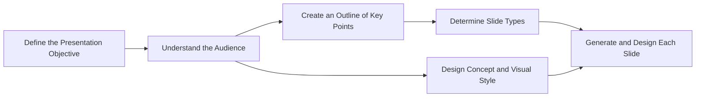

https://mermaid.live/edit#pako:eNpdkU1PwzAMhv-KlfN2YB8cioRUrYgDICYKHGh3MI27BqVOlTqgatp_J1u3IZFTnDx-9CbeqcppUomqrfupGvQCjy83JUNc6VWRUW2YQBqCtaeeWFCMY3j-_KJKzDdtYDq9hXRWvLEm3wuyPtJp0Ia4os1JNRu5ebHyhEKA0RHEHuSuhgcaYO0MS3_m5yO_jAmEfHvgcms0wevQ0YVajtR1cU9MfvRqyKg3W4Y7rJqx6V-IRXEiVi4m7OTY9G76gBZyGeyFX5z0aqLaGAKNjh-1O1yWKj6ypVIlcaupxmClVCXvI4pBXD5wpRLxgSbKu7BtzkXodIyZGdx6bFVSo-3jaYf84dxfTdqI80_jZI4D2v8CR1WJLA

